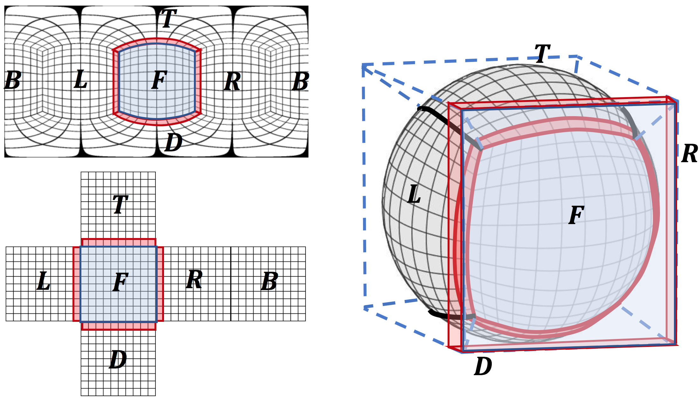
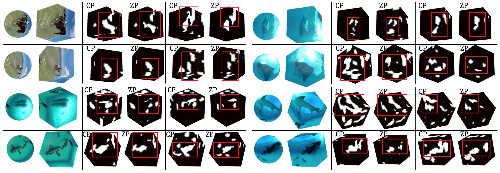
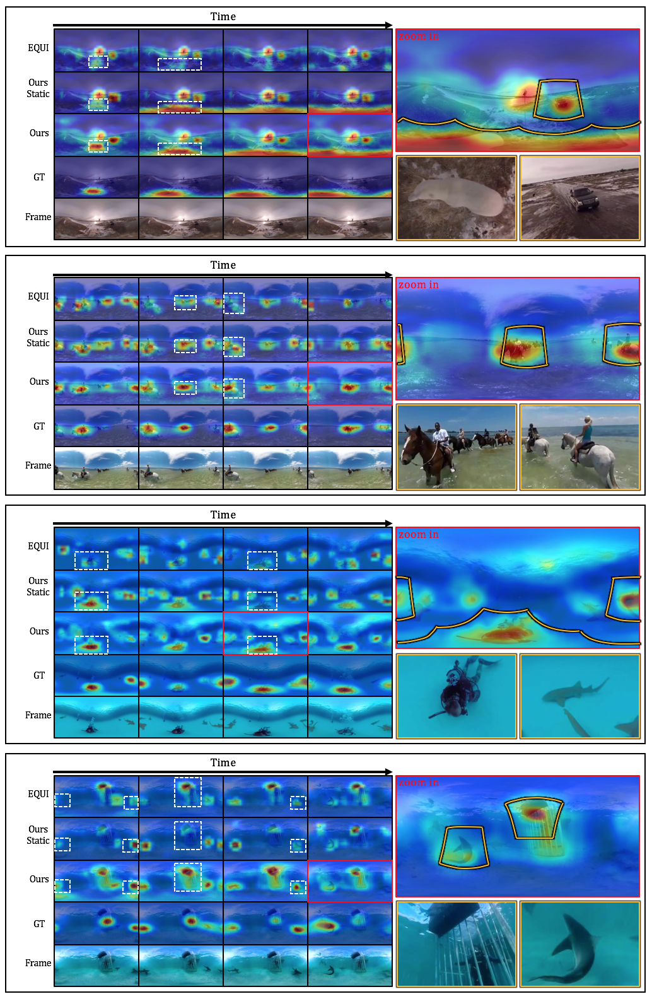

# CP-360-Weakly-Supervised-Saliency
This is the code for [Cube Padding for Weakly-Supervised Saliency Prediction in 360° Videos](http://aliensunmin.github.io/project/360saliency/), including ResNet-50 static feature extractor and ConvLSTM temporal model.

## Getting Started
Clone the repo:
```
git clone https://github.com/hsientzucheng/CP-360-Weakly-Supervised-Saliency.git
```

## Requirements
Tested under
- Python == 3.6
- PyTorch >= 0.3
- cv2 == 3.4.2
- Other dependencies:
    - tqdm, scipy, matplotlib, PIL, ruamel_yaml, collections

## Model
### Pretrained model
You can download our convolution LSTM model [here](https://drive.google.com/file/d/1uOI4c9ojCU0pvUHN4cdf-JYUyWqkf-gm/view?usp=sharing)
The model should be put into the directory:
```
[CP-360-Weakly-Supervised-Saliency PATH]/checkpoint/CLSTM_model_released.pth
Performance: AUC 0.898; CC 0.494; AUCB 0.874
```
### CubePadding





The cube padding module in cube_pad.py
```
python [CP-360-Weakly-Supervised-Saliency PATH]/model/cube_pad.py
```


## Dataset 
To get Wild-360 dataset, check our [project website](http://aliensunmin.github.io/project/360saliency/).

We use 25 videos for testing and 60 for training as shown in txt files in utils.
### Ground truth annotated fixations + sample heatmap visualization
```
|- Wild360_GT
|	|- video_id_1.mp4
|	|	|- 00000.npy
|	|	|- 00001.npy
|	|	|	...
|	|	|- overlay
|	|	|	|- 00000.jpg
|	|	|	|- 00001.jpg
|	|	|	|	...
|	|- video_id_2.mp4
|	|	|	...
```

### Train/test videos (ID in test set got corresponding ground truth)
```
|- 360_Discovery
|	|- train
|	|	|- train_video_id_1.mp4
|	|	|- train_video_id_2.mp4
|	|	|	...
|	|- test
|	|	|- test_video_id_1.mp4
|	|	|	...
```

## Inference
- To run the inference process, you should first modify the config file
```
vim [CP-360-Weakly-Supervised-Saliency PATH]/config.yaml
```

- After installing requirements and setting up the configurations, the static model can be run as:
```
cd static_model
python dataset_feat_extractor.py --mode resnet50 -oi -of
```

- Having the features from the static model, run the temporal model by:
```
cd temporal_model
python test_temporal.py --dir ../output/static_resnet50 --model CLSTM_model_released.pth --overlay
```

- These commands are in the script, just run:
```
bash inference.sh
```

## Train
- You might want to modify the config file first for some training args:
```
vim [CP-360-Weakly-Supervised-Saliency PATH]/config.yaml
```

- Extract optical flow to train the temporal model:
```
cd static_model
python dataset_feat_extractor.py --mode resnet50 -om
```

- Train your model by running:
```
bash train.sh
```

- The model you train will be saved in (see config.yaml for these args):
```
vim [CP-360-Weakly-Supervised-Saliency PATH]/checkpoint/CLSTM_s_[l_s]_t_[l_t]_m_[l_m]/CLSTM_[epoch]_[iter].pth
```

## Results

In each block, consecutive frames of various methods, ground truth, and raw videos are shown in the left panel. 
We highlight regions for comparison using white dash rectangles. 
In the right panel, one example is zoom-in (red box) and two salient NFoVs (yellow boxes) are rendered. 

## Notes
- Our method to train temporal model is only suitable for stationary videos (without camera motion). For more complicated cases, you might want to compensate camera motion and apply 360 stablization.

## Citation
```
@inproceedings{cheng2018cube,
  title={Cube padding for weakly-supervised saliency prediction in 360 videos},
  author={Cheng, Hsien-Tzu and Chao, Chun-Hung and Dong, Jin-Dong and Wen, Hao-Kai and Liu, Tyng-Luh and Sun, Min},
  booktitle={Proceedings of the IEEE Conference on Computer Vision and Pattern Recognition},
  pages={1420--1429},
  year={2018}
}
```

